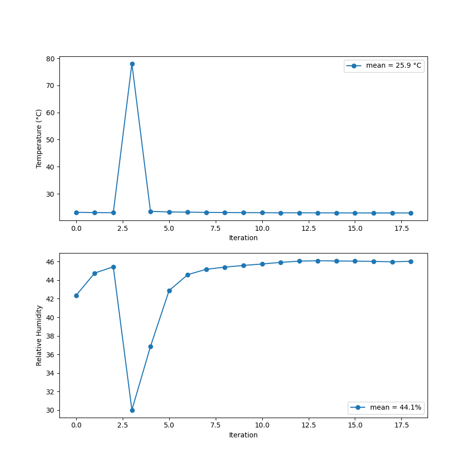

# sht4x

This is an example [ESP-IDF][1] application for the [Sensirion
SHT4x][2] temperature and humidity sensor.

## Configuration

Edit [main.c][main] with the GPIO pins for your I²C SDA and SCL lines.

    #define SDA GPIO_NUM_6
    #define SDL GPIO_NUM_5

## Example output

    $ idf.py build flash monitor

    ESP-ROM:esp32s2-rc4-20191025
    Build:Oct 25 2019
    rst:0x1 (POWERON),boot:0x8 (SPI_FAST_FLASH_BOOT)
    ...
    I (277) main_task: Calling app_main()
    I (277) main: version 0.1.0
    I (307) sht4x: found device 0x108906f5
    ** 0 23.285648 30.964981
    ** 1 23.277637 30.985962
    ** 2 23.253605 31.016479
    I (15337) main: heating....
    ** 3 26.308460 31.390326
    ** 4 23.248264 30.987869
    ** 5 23.226902 31.052719
    ...

On the third iteration, the heating capibility of the SHT4x sensor is
activated.

## Plot

A Python script is provided to visualize the temperature and humidity in real-time.

    $ ./scripts/plot.py

## Component installation

See the [component documunation](components/sht4x/README.md) to use
this code as a component in your own project.

## Help / Contributing

[Bug reports][issues] and [pull requests][pulls] are very much
encouraged.

## License

[MIT](LICENSE)

[issues]: https://github.com/bitmandu/sht4x/issues
[pulls]: https://github.com/bitmandu/sht4x/pulls
[1]: https://docs.espressif.com/projects/esp-idf/en/latest/esp32/index.html
[2]: https://developer.sensirion.com/sensirion-products/sht4x-humidity-and-temperature-sensors/
[main]: https://github.com/bitmandu/sht4x/blob/f42b57e60b53f3d6240ba4bc87fa319182d69bb7/main/main.c#L16
